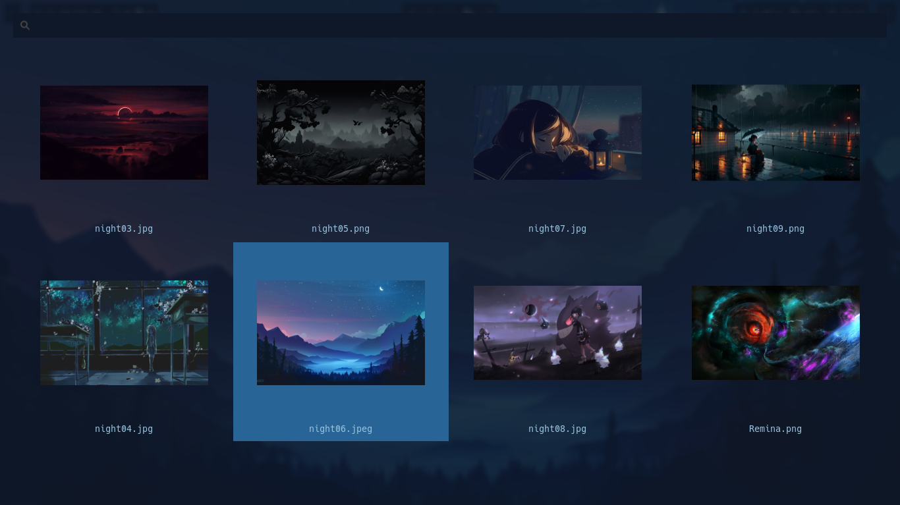
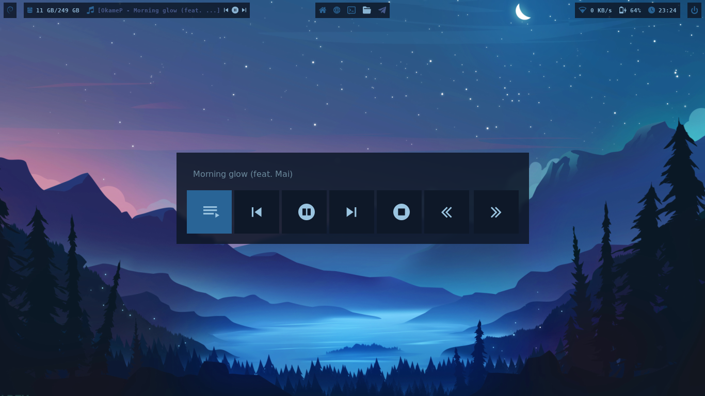
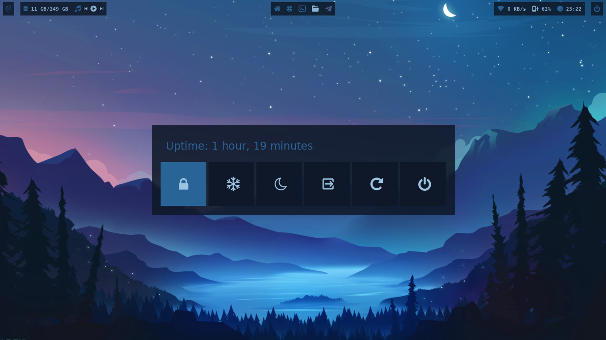

# DOTFILES

Dear future me, if you're still there, these are your personal dotfiles in bspwm. I'm also sharing them in case they might be useful to someone. Greetings from Mexico or the beyond

### Icons
```sh
# Add icons in
.local/share/icons/
```

### Fonts
* Hack Nerd Font [Here](https://www.nerdfonts.com/)

### Rofi Launchers

**NOTE**: *There is also a launcher for Wi-Fi.*

#### Swallp
It's a script to change the wallpaper and terminal colors; it requires *pywall* and *feh*



#### Destiny
A script to playing music; it requires *mpd* and *mpc*



#### Poweroff



